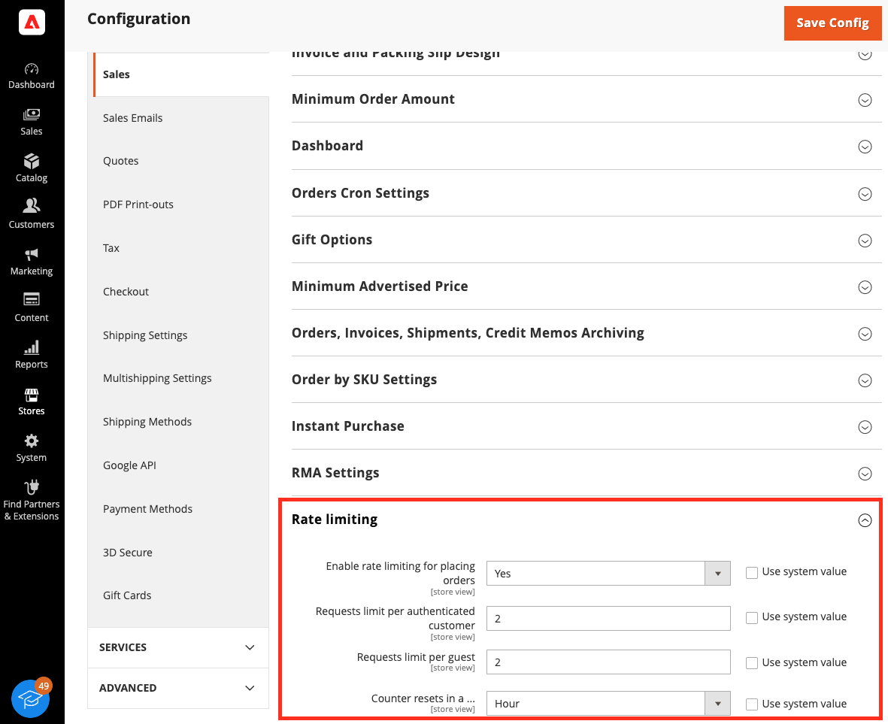

This topic describes best practices for [API security](https://owasp.org/www-project-api-security/).

# API security

## Rate limiting for payment information endpoint and mutation

In a carding attack, an attacker tries to determine which credit card numbers are valid, usually in batches of thousands. Attackers can use similar techniques to brute force missing details, like the expiration date. Adobe Commerce merchants can be targeted by this attack type through their shops and integrations with 3rd-party payment gateways.

As of Adobe Commerce 2.4.7, you can configure rate limiting for the payment information transmitted using REST and GraphQL. This added layer of protection allows merchants to prevent and decrease the volume of carding attacks that test many credit card numbers at once.

Rate limiting is disabled by default, but you can enable and configure this feature from either the CLI or the Admin. The threshold can be configured by interval and set independently for customers and guests.

### How rate limiting works

The rate limiting functionality affects the following entry points:

- REST:
    - `<base_url>/rest/V1/<store_code>/guest-carts/<cart_id>/payment-information`
    - `<base_url>/rest/V1/<store_code>/guest-carts/<cart_id>/order`
    - `<base_url>/rest/V1/<store_code>/carts/mine/payment-information`
    - `<base_url>/rest/V1/<store_code>/carts/mine/order`
- GraphQL: `<base_url>/graphql`

- Module InstantPurchase `magento/module-instant-purchase`

### Enable rate limiting

Prerequisite: You must configure Redis to enable rate limiting.

| Parametr                       | Description                               |
|--------------------------------|-------------------------------------------|
| sales/backpressure/enabled     | Enable rate limiting for placing orders.  |
| sales/backpressure/guest_limit | Requests limit per guest                  |
| sales/backpressure/limit       | Requests limit per authenticated customer |
| sales/backpressure/period      | Counter resets in a ... [sec.]            |

Example:

- Sales restrictions are enabled `sales/backpressure/enabled` = `1`.
- Anonymous users are limited to 50 orders (`sales/backpressure/guest_limit` = `50`) from a single IP address within one minute (`sales/backpressure/period - 60`).  If they exceed the order limit, then they will have to wait three times the specified `period` of time from their last request.
-  For example, if an authorized user attempts to place more than `10` orders (`sales/backpressure/limit` = `10`) within the `period` of `60` seconds, then the user will not be able to place an order for a period of `180` seconds.

Since this functionality is disabled by default, you need to add a configuration that connects to the service where the request logs will be stored. By default, the connection is configured for a Redis server.
The following options work for new and existing installations:

```terminal
--backpressure-logger=BACKPRESSURE-LOGGER                                                  Backpressure logger handler
--backpressure-logger-redis-server=BACKPRESSURE-LOGGER-REDIS-SERVER                        Redis server
--backpressure-logger-redis-port=BACKPRESSURE-LOGGER-REDIS-PORT                            Redis server listen port
--backpressure-logger-redis-timeout=BACKPRESSURE-LOGGER-REDIS-TIMEOUT                      Redis server timeout
--backpressure-logger-redis-persistent=BACKPRESSURE-LOGGER-REDIS-PERSISTENT                Redis persistent
--backpressure-logger-redis-db=BACKPRESSURE-LOGGER-REDIS-DB                                Redis db number
--backpressure-logger-redis-password=BACKPRESSURE-LOGGER-REDIS-PASSWORD                    Redis server password
--backpressure-logger-redis-user=BACKPRESSURE-LOGGER-REDIS-USER                            Redis server user
--backpressure-logger-id-prefix=BACKPRESSURE-LOGGER-ID-PREFIX                              ID prefix for keys
```

<InlineAlert variant="info" slots="text"/>

The data, including request time and identifier, is temporarily stored in Redis. Registered users are identified by their user ID. Non-registered users are identified by their external IP address.

The following command will add a new connection to the Redis server:

Redis server:

- Host: 195.34.23.5
- Port: 9345
- Password: s0M3StR0NgP@SsW0Rd
- User: SomeUser

```bash
$ bin/magento setup:config:set \
    --backpressure-logger=redis \
    --backpressure-logger-redis-server=195.34.23.5 \
    --backpressure-logger-redis-port=9345 \
    --backpressure-logger-redis-timeout=1 \
    --backpressure-logger-redis-persistent=persistent \
    --backpressure-logger-redis-db=3 \
    --backpressure-logger-redis-password=s0M3StR0NgP@SsW0Rd\
    --backpressure-logger-redis-user=SomeUser \
    --backpressure-logger-id-prefix=some_pref
```

After the command is executed, the following configuration is added to the `app/etc/env.php` file.

```php
[
//...
    'backpressure' => [
        'logger' => [
            'type' => 'redis',
            'options' => [
                'server' => '195.34.23.5',
                'port' => 9345,
                'timeout' => 1,
                'persistent' => 'persistent',
                'db' => '3',
                'password' => 's0meStr0ngPassw0rd',
                'user' => 'SomeUser'
            ],
            'id-prefix' => 'some_pref'
        ]
    ]
//...
];
```

Use the following commands to enable rate limiting:

1. Enable (`1`) or disable (`0`) rate limiting for placing orders:

    ```bash
    $ bin/magento config:set sales/backpressure/enabled 1
    ```
1. Set the request limit per guest (IP address):

    ```bash
    $ bin/magento config:set sales/backpressure/guest_limit 100
    ```
  
1. Set the request limit for authenticated customers:

    ```bash
    $ bin/magento config:set sales/backpressure/limit 10
    ```
1. Set the period of time (in seconds) for the request limit. Supported values `60`, `3600`, `86400` seconds. This time period is multiplied by three to calculate the timeout period:

    ```bash
    $ bin/magento config:set sales/backpressure/period 60
    ```
If you need to check a configuration, use the following CLI command:

Example:

```bash
$ bin/magento config:show | grep backpressure
Response:

```terminal
sales/backpressure/limit - 10
sales/backpressure/guest_limit - 100
sales/backpressure/period - 3600
sales/backpressure/enabled - 1
```

You can also enable and configure rate limiting in the user interface: **Stores** > **Configuration** > **Sales** > **Sales** > **Rate Limiting**:



<InlineAlert variant="info" slots="text"/>

If rate limiting has been enabled for the payment information endpoint and the GraphQl mutation via the UI/CLI, but the Redis service connection for store log requests has not been configured in the `app/etc/env.php` file, then the rate-limiting will not apply. The behavior will be the same if this option is disabled, but the application logs (`<magento-root>/var/log/system.log`) will contain the following message:

```text
...
[2022-11-11T15:46:32.716679+00:00] main.ERROR: Backpressure sliding window not applied. Invalid request logger type:  [] []
...
[2022-11-11T15:46:37.730863+00:00] main.ERROR: Backpressure sliding window not applied. Invalid request logger type:  [] []
...
```

#### Example Responses

If rate limiting is applied to a REST request, then a response with HTTP status code `429 - Too Many Requests` will be generated.

Example:

```text
HTTP/1.1 429 Too Many Requests
...
Pragma: no-cache
Cache-Control: no-store
...
{"message":"Too Many Requests","trace":null}
```

If rate limiting is applied to a GraphQl request, then a response with HTTP status code `200 - Ok` will be generated and all relevant information will be present in the response body.

Example:

```text
HTTP/1.1 200 OK
...
Pragma: no-cache
Cache-Control: max-age=0, must-revalidate, no-cache, no-store
 ...
{
    "errors":[
        {
            "message":"Too Many Requests",
            "extensions":{"category":"graphql-too-many-requests"},
             "locations":[
                 {"line":2,"column":3}
             ],
             "path":["placeOrder"]
        }
    ],
    "data":{"placeOrder":null}
}
```

## Input limiting

Imposing restrictions on the size and number of resources that a user can request through an API can help mitigate denial-of-service (DoS) vulnerabilities. By default, the following built-in API rate limiting is available:

-  REST requests containing inputs that represent a list of entities. When enabled, the default maximum is 20 for synchronous requests and 5,000 for asynchronous requests.
-  REST and GraphQL queries that allow paginated results can be limited to a maximum number of items per page. When enabled, the default maximum is 300.
-  REST queries that allow paginated results can have a default number of items per page imposed. When enabled, the default maximum is 20.

By default, these input limits are disabled, but you can use the following methods to enable them:

-  Set the values in the [Admin](https://docs.magento.com/user-guide/configuration/services/magento-web-api.html).
-  Run the [`bin/magento config:set` command](https://experienceleague.adobe.com/docs/commerce-operations/configuration-guide/cli/configuration-management/set-configuration-values.html).
-  Add entries to the [`env.php` file](https://experienceleague.adobe.com/docs/commerce-operations/configuration-guide/files/config-reference-configphp.html#system).
-  Set [environment variables](https://experienceleague.adobe.com/docs/commerce-operations/configuration-guide/deployment/examples/example-environment-variables.html).

When input limiting has been enabled, the system uses the default value for each limitation listed above. You can also configure custom values.

Although some simple examples for configuring these values from the CLI are provided below, all of the values can be [configured per website and per store view](https://experienceleague.adobe.com/docs/commerce-operations/configuration-guide/cli/configuration-management/set-configuration-values.html) in addition to being configurable globally. In addition, these values can also be configured [via `env.php`](https://experienceleague.adobe.com/docs/commerce-operations/configuration-guide/files/config-reference-configphp.html#system)
as well as via [environment variables](https://experienceleague.adobe.com/docs/commerce-operations/configuration-guide/deployment/examples/example-environment-variables.html).

<InlineAlert variant="info" slots="text"/>

In addition, the Admin provides a configuration setting for limiting session sizes for Admin users and storefront visitors.

### Enable the input limiting system

To enable these input limiting features from the Admin, go to **Stores** > Settings > **Configuration** > **Services** > **Web Api Limits** or **GraphQL Input Limits** and set **Enable Input Limits** to **Yes**.

To enable with the CLI, run one or both of the following commands:

```bash
bin/magento config:set webapi/validation/input_limit_enabled 1
```

```bash
bin/magento config:set graphql/validation/input_limit_enabled 1
```

### Maximum parameter inputs

The `EntityArrayValidator` class constructor limits the number of objects that can be given to inputs that represent arrays of objects. For example, the `PUT /V1/guest-carts/{cartId}/collect-totals` endpoint contains the input parameter `additionalData->extension_attributes->gift_messages`, which represents a list of gift message information objects.

There are four possible input arrays:

-  `additional_data`
-  `agreement_ids`
-  `gift_messages`
-  `custom_attributes`

```json
{
  "paymentMethod": {
    "po_number": "string",
    "method": "string",
    "additional_data": [
      "string"
    ],
    "extension_attributes": {
      "agreement_ids": [
        "string"
      ]
    }
  },
  "shippingCarrierCode": "string",
  "shippingMethodCode": "string",
  "additionalData": {
    "extension_attributes": {
      "gift_messages": [
        {
          "gift_message_id": 0,
          "customer_id": 0,
          "sender": "string",
          "recipient": "string",
          "message": "string",
          "extension_attributes": {
            "entity_id": "string",
            "entity_type": "string",
            "wrapping_id": 0,
            "wrapping_allow_gift_receipt": true,
            "wrapping_add_printed_card": true
          }
        }
      ]
    },
    "custom_attributes": [
      {
        "attribute_code": "string",
        "value": "string"
      }
    ]
  }
}
```

By default, any one of these arrays can include up to 20 items, but you can change this value in the configuration UI via **Stores** > Settings > **Configuration** > **Services** > **Web API Input Limits** > **Input List Limit** or via CLI using the `webapi/validation/complex_array_limit` configuration path.

### Input limit for REST endpoints

Some REST endpoints can contain a high number of elements, and developers need a way to set the limit for each endpoint. The limit for a specific REST endpoint can be set in the `webapi.xml` configuration file for synchronous requests and `webapi_async.xml` for asynchronous requests.
To do this, assign a value for the `<data input-array-size-limit/>` attribute within a `<route>` definition. The value for `input-array-size-limit` must be a non-negative integer.

The following example sets the input limit for the `/V1/some-custom-route` route.
If the route works synchronously, open the `<module_dir>/etc/webapi.xml` configuration file. Otherwise, open `<module_dir>/etc/webapi_async.xml`.
Add the `data` tag with the `input-array-size-limit` attribute to the route configuration.

```xml
<?xml version="1.0"?>
<!--
Some custom module
-->    
<routes xmlns:xsi="http://www.w3.org/2001/XMLSchema-instance"
        xsi:noNamespaceSchemaLocation="urn:magento:module:Magento_Webapi:etc/webapi.xsd">
    <route url="/V1/some-custom-route" method="POST">
        <service class="Vendor\Module\Api\EntityRepositoryInterface" method="save"/>
        <resources>
            <resource ref="Vendor_Entity::entities" />
        </resources>
        <data input-array-size-limit="5" /> <!--  limit only for route `/V1/some-custom-route`  -->
    </route>
</routes>
```

Clear the configuration cache for the changes to take effect.

```bash
bin/magento cache:clean config
```

### Values by default for REST endpoints

If you need to change the default limits for REST endpoints, then edit the `webapi` section of the `<magento_root>/app/etc/env.php` file as follows:

```php
[
//...
    'webapi' => [
        'sync' => [
            'default_input_array_size_limit' => <non-negative value>, //overrides values for synchronous REST endpoints
        ],
        'async' => [
            'default_input_array_size_limit' => <non-negative value>, //overrides values for asynchronous REST endpoints
        ],
    ]
//...
];
```

### Maximum page size

The maximum page size setting controls the pagination of various web API responses. By default, the maximum value is `300`. You can change the default in the Admin by selecting **Stores** > Settings > **Configuration** > **Services** > **Web API Input Limits** or **GraphQl Input Limits** >  **Maximum Page Size** field.

[GraphQL security configuration](../graphql/usage/security-configuration.md describes how to set the maximum page size in GraphQL.

### Default page size

The Default Page Size setting controls the pagination of various web API responses. You can change the default value of `20` in the Admin by selecting **Stores** > Settings > **Configuration** > **Services** > **Web API Input Limits** > **Default Page Size**. To change the value from the CLI, run the following command:

```bash
bin/magento config:set webapi/validation/default_page_size 30
```
