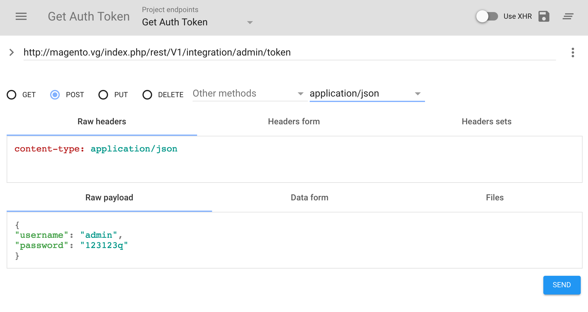

# Token-based authentication

<InlineAlert variant="info" slots="text"/>

This topic is for Platform-as-a-Service (PaaS) customers only. Adobe Commerce Cloud Services customers must refer to [REST Authentication](https://developer.adobe.com/commerce/services/cloud/guides/rest/authentication/) for details on authentication.

To make a web API call from a client such as a mobile application, you must supply an *access token* on the call. The token acts like an electronic key that lets you access the API.

Adobe Commerce and Magento Open Source issue the following types of access tokens:

Token type | Description | Default lifetime
--- | --- | ---
Integration | The merchant determines which Commerce resources the integration can access. | Indefinite. It lasts until it is manually revoked.
Admin | The merchant determines which Commerce resources an admin user has access to. | 4 hours
Customer | Commerce grants access to resources with the `anonymous` or `self` permission. Merchants cannot edit these settings. | 1 hour

## Integration tokens

When a merchant creates and activates an integration, Commerce generates a consumer key, consumer secret, access token, and access token secret. All of these entities are used for [OAuth-based authentication](./gs-authentication-oauth.md).

In previous versions of Commerce, the access token could be used on its own for token-based authentication. This behavior has been disabled by default due to the security implications of a never-expiring access token. Namely, if the access token is compromised it provides undetected persistent access to a store.

However, while it is not recommended, this behavior can be restored in the Admin by setting the **Stores** > **Configuration** > **Services** > **OAuth** > **Consumer Settings** > **Allow OAuth Access Tokens to be used as standalone Bearer tokens** option to **Yes**. You can also enable this setting from the CLI by running the following command:

```bash
bin/magento config:set oauth/consumer/enable_integration_as_bearer 1
```

If you are trying to upgrade from a previous version and need to update your integration implementation to properly utilize the OAuth workflow, review [OAuth-based Authentication](./gs-authentication-oauth.md). Otherwise, you can partially update your integration to simply store and utilize all four credentials to sign your requests.

There is a comprehensive guide for this on the OAuth-based authentication page, but can also be done in isolation without supporting the entire OAuth workflow. For example, in the following script the four credentials are used to create a new CMS page without using external libraries or implementing the full OAuth handshake.
<p></p>
<details>
      <summary><b>standalone-oauth.php </b></summary>

```php
<?php
const CONSUMER_KEY = '<placeholder>';
const CONSUMER_SECRET = '<placeholder>';
const ACCESS_TOKEN = '<placeholder>';
const ACCESS_TOKEN_SECRET = '<placeholder>';

class RequestDTO {
    public function __construct(
        public string $url,
        public string $method = 'GET',
        public ?string $body = null,
        public array $headers = [],
    ) {}
}
class OAuthCredentialsDTO {
    public function __construct(
        public string $consumerKey,
        public string $consumerSecret,
        public string $accessToken,
        public string $accessTokenSecret
    ) {}
}

class OAuthRequestSigner
{
    public function sign(
        RequestDTO $request,
        OAuthCredentialsDTO $credentials
    ): string {
        $urlParts = parse_url($request->url);
        // Normalize the OAuth params for the base string
        $normalizedHeaders = $request->headers;
        sort($normalizedHeaders);
        $oauthParams = [
            'oauth_consumer_key' => $credentials->consumerKey,
            'oauth_nonce' => base64_encode(random_bytes(32)),
            'oauth_signature_method' => 'HMAC-SHA256',
            'oauth_timestamp' => time(),
            'oauth_token' => $credentials->accessToken
        ];
        // Create the base string
        $signingUrl = $urlParts['scheme'] . '://' . $urlParts['host'] . $urlParts['path'];
        $paramString = $this->createParamString($urlParts['query'] ?? null, $oauthParams);
        $baseString = strtoupper($request->method) . '&' . rawurlencode($signingUrl) . '&' . rawurlencode($paramString);
        // Create the signature
        $signatureKey = $credentials->consumerSecret . '&' . $credentials->accessTokenSecret;
        $signature = base64_encode(hash_hmac('sha256', $baseString, $signatureKey, true));
        return $this->createOAuthHeader($oauthParams, $signature);
    }
    private function createParamString(?string $query, array $oauthParams): string
    {
        // Create the params string
        $params = array_merge([], $oauthParams);
        if (!empty($query)) {
            foreach (explode('&', $query) as $paramToValue) {
                $paramData = explode('=', $paramToValue);
                if (count($paramData) === 2) {
                    $params[rawurldecode($paramData[0])] = rawurldecode($paramData[1]);
                }
            }
        }
        ksort($params);
        $paramString = '';
        foreach ($params as $param => $value) {
            $paramString .= rawurlencode($param) . '=' . rawurlencode($value) . '&';
        }
        return rtrim($paramString, '&');
    }
    private function createOAuthHeader(array $oauthParams, string $signature): string
    {
        // Create the OAuth header
        $oauthHeader = "Authorization: Oauth ";
        foreach ($oauthParams as $param => $value) {
            $oauthHeader .= "$param=\"$value\",";
        }
        return $oauthHeader . "oauth_signature=\"$signature\"";
    }
}

function send(RequestDTO $request): string
{
    $ch = curl_init();
    curl_setopt($ch, CURLOPT_URL, $request->url);
    curl_setopt($ch, CURLOPT_HEADER, false);
    curl_setopt($ch, CURLOPT_HTTPHEADER, $request->headers);
    curl_setopt($ch, CURLOPT_RETURNTRANSFER, true);
    curl_setopt($ch, CURLOPT_CUSTOMREQUEST, $request->method);
    curl_setopt($ch, CURLOPT_POSTFIELDS, $request->body ?? '');
    return (string)curl_exec($ch);
}

$oauthSigner = new OAuthRequestSigner();
$request = new RequestDTO(
    'https://example.com/rest/V1/cmsPage',
    'POST',
    '{
          "page": {
            "identifier": "test-page",
            "title": "my-page",
            "content": "<h1>hello</h1>",
            "active": true
          }
        }',
    ['Content-Type: application/json']
);
$request->headers[] = $oauthSigner->sign(
    $request,
    new OAuthCredentialsDTO(
        CONSUMER_KEY,
        CONSUMER_SECRET,
        ACCESS_TOKEN,
        ACCESS_TOKEN_SECRET
    )
);
echo send($request);
```

</details>

## Admin and customer access tokens

Commerce provides a separate token service for administrators and customers. When you request a token from one of these services, the service returns a unique access token in exchange for an account's username and password.

The web API framework allows *guest users* to access resources that are configured with the permission level of anonymous. Guest users are users who the framework cannot authenticate through existing authentication mechanisms. As a guest user, you do not need to, but you can, specify a token in a web API call for a resource with anonymous permission. [Restricting access to anonymous web APIs](https://developer.adobe.com/commerce/webapi/rest/use-rest/anonymous-api-security/) contains a list of APIs that do not require a token.

The following table lists endpoints and services that can be used to get an authentication token. Admin accounts must be authenticated with a [two factor authentication](https://developer.adobe.com/commerce/testing/functional-testing-framework/two-factor-authentication/) provider. Some providers may require multiple calls.

Token type |REST| SOAP
---|---|---
Admin with Google Authenticator | `POST /V1/tfa/provider/google/authenticate` | `twoFactorAuthGoogleAuthenticateV1`
Admin with Duo Security | `POST /V1/tfa/provider/duo-security/authenticate` | `twoFactorAuthDuoAuthenticateV1`
Admin with Authy | `POST /V1/tfa/provider/authy/authenticate` | `twoFactorAuthAuthyAuthenticateV1`
Admin with U2F | `POST /V1/tfa/provider/u2fkey/verify` | `twoFactorAuthU2fKeyAuthenticateV1`
Customer | `POST /V1/integration/customer/token` | `integrationCustomerTokenServiceV1`

For most web API calls, you supply this token in the `Authorization` request header with the `Bearer` HTTP authorization scheme to prove your identity. By default, an admin token is valid for 4 hours, while a customer token is valid for 1 hour. You can change these values from Admin by selecting **Stores** > **Settings** > **Configuration** > **Services** > **OAuth** > **Access Token Expiration**.

A cron job that runs hourly removes all expired tokens.

## IMS access tokens for web API calls

Web API services and events need access tokens to provide authentication credentials to protected resources once the Commerce Admin is integrated with the IMS authentication workflow.

### IMS access tokens and the admin_adobe_ims_webapi table

Each IMS access token is defined by an `access_token_hash` entry in the `admin_adobe_ims_webapi` table. This table keeps a record of all validated access tokens. When a token is validated or invalidated, a record of its status is preserved here.

### Access token expiration

No dependency exists between IMS access token lifetime and Commerce session lifetime. Access token life is set by the Adobe IMS service and has a default value of 24 hours. Each access token's expiration time is saved in an `expires_in` value in the `admin_adobe_ims_webapi` table.

## Request a token

A access token request contains three basic elements:

Component | Specifies
--- | ---
Endpoint |  A combination of the *server* that fulfills the request, the web service, and the `resource` against which the request is being made.<br/><br/>For example, in the `POST <host>/rest/<store_code>/V1/integration/customer/token` endpoint:<br/>The server is `magento.host/index.php/`,<br/> the web service is `rest`.<br/> and the resource is `/V1/integration/customer/token`.
Content type | The content type of the request body. Set this value to either `"Content-Type:application/json"` or `"Content-Type:application/xml"`.
Credentials | The username and password for a Commerce account.<br/><br/>To specify these credentials in a JSON request body, include code similar to the following in the call: <br/><br/>`{"username":"<USER-NAME>", "password":"<PASSWORD>"}`<br/><br/>To specify these credentials in XML, include code similar to the following in the call:<br/><br/>`<login><username>customer1</username><password>customer1pw</password></login>`

### Examples

The following image shows a token request for the admin account using a REST client:



The following example uses the `curl` command to request a token for a customer account:

```bash
curl -X POST "https://<host>/rest/default/V1/integration/customer/token" \
     -H "Content-Type:application/json" \
     -d '{"username":"customer@example.com", "password":"customer_password"}'
```

The following example makes the same request with XML for a customer account token:

```bash
curl -X POST "http://<host>/rest/default/V1/integration/customer/token" \
     -H "Content-Type:application/xml"  \
     -d "<login><username>customer1</username><password>customer1pw</password></login>"
```

For more information about the `curl` command, see [Use cURL to run the request](../gs-curl.md)

## Authentication token response

A successful request returns a response body with the token, as follows:

`asdf3hjklp5iuytre`

## Use the token in a Web API request

Any web API call that accesses a resource that requires a permission level higher than anonymous must contain the authentication token in the header To do this, specify a HTTP header in the following format:

`Authorization: Bearer <authentication token>`

### Admin access

Admins can access any resources for which they are authorized.

For example, to make a web API call with an admin token:

`curl -X GET "http://<host>/rest/default/V1/customers/2" -H "Authorization: Bearer vbnf3hjklp5iuytre"`

### Customer access

Customers can access only resources with `self` permissions.

For example, to make a web API call with a customer token:
`curl -X GET "http://<host>/rest/default/V1/customers/me" -H "Authorization: Bearer asdf3hjklp5iuytre"`

#### Related topics

[Construct a request](../gs-web-api-request.md)

[Configure services as web APIs](https://developer.adobe.com/commerce/php/development/components/web-api/services/)

[Restricting access to anonymous web APIs](https://developer.adobe.com/commerce/webapi/rest/use-rest/anonymous-api-security/)
