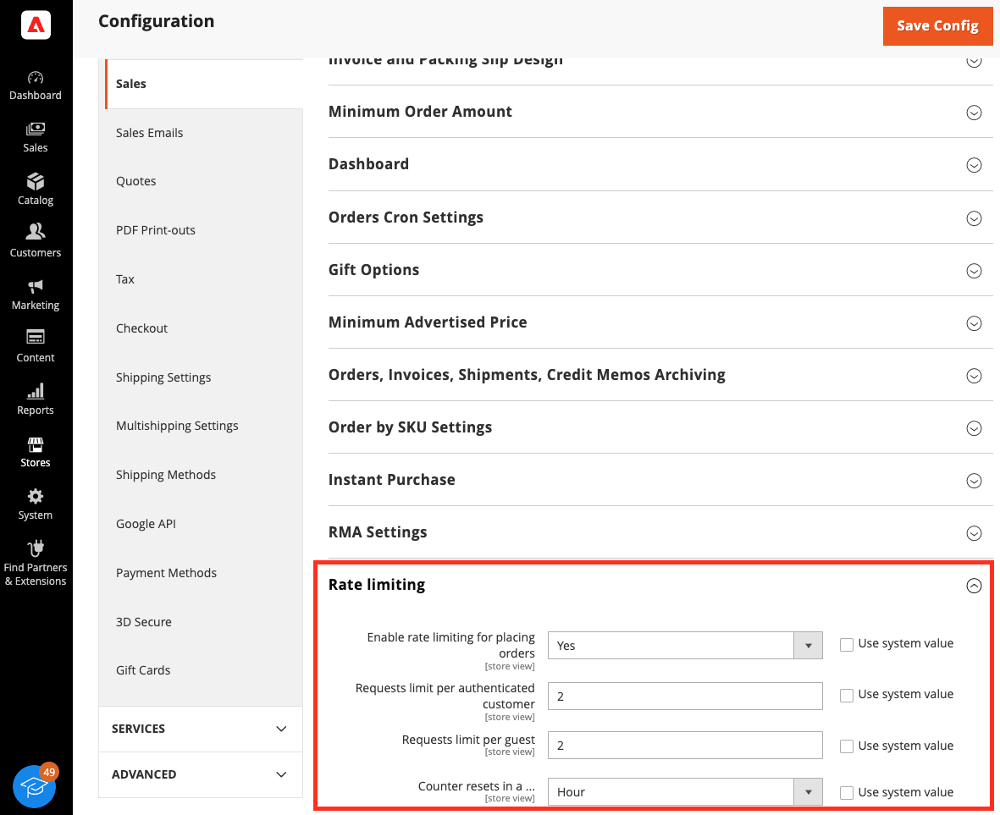

# Rate limiting

In a carding attack, an attacker tries to determine which credit card numbers are valid, usually in batches of thousands. Attackers can use similar techniques to brute force missing details, such as the expiration date. Adobe Commerce merchants can be targeted by this attack type through their shops and integrations with third-party payment gateways.

As of Adobe Commerce 2.4.7, you can configure rate limiting for the payment information transmitted using REST and GraphQL. This added layer of protection allows merchants to prevent and decrease the volume of carding attacks that test many credit card numbers at once.

The rate limiting functionality affects the following entry points:

REST:

- `<base_url>/rest/V1/<store_code>/guest-carts/<cart_id>/payment-information`
- `<base_url>/rest/V1/<store_code>/guest-carts/<cart_id>/order`
- `<base_url>/rest/V1/<store_code>/carts/mine/payment-information`
- `<base_url>/rest/V1/<store_code>/carts/mine/order`

GraphQL:

- `<base_url>/graphql`

InstantPurchase module:

- `magento/module-instant-purchase`

Setting up rate limiting has two discrete steps:

1. Add a configuration that connects to the service where the request logs will be stored. By default, the connection is configured for a Redis server. Most merchants must configure a cloud or local installation of Redis to implement the rate limiting feature. However, merchants who have [instances hosted on Amazon EC2](#use-aws-elasticache-with-your-ec2-instance) use an AWS ElastiCache instead of a cloud or local Redis instance.

  **Note:** The data, including request time and identifier, is temporarily stored in Redis. Registered users are identified by their user ID. Non-registered users are identified by their external IP address.

1. Configure Commerce to set restrictions on guest users and authenticated customers. This step is the same for all merchants.

## Set the Redis service connection (most merchants)

The [Configure Redis](https://experienceleague.adobe.com/docs/commerce-operations/configuration-guide/cache/redis/config-redis.html) topic in the _Commerce Configuration Guide_ describes basic installation and configuration information.

Commerce provides command-line options to configure the connection to the backpressure logger. Although you can configure the backpressure logger by editing the `<Commerce-install-dir>/app/etc/env.php` file, using the command line is the recommended method, especially for initial configurations. The command line provides validation, ensuring the configuration is syntactically correct.

By default, the connection is configured for a Redis server. Use the following `bin/magento setup:config:set` commands to configure the Redis service connection:

Command line parameter | Value | Description | Default
--- | --- | --- | ---
`--backpressure-logger` | `redis` | Specifies the backpressure logger handler | This value must be set to `redis`.
`--backpressure-logger-id-prefix` | String | ID prefix for keys | None
`--backpressure-logger-redis-db` | Database number | Required if you use Redis for both the default and full-page cache. You must specify the database number of one of the caches; the other cache uses 0 by default.<br/><br/>**Important**: If you use Redis for more than one type of caching, the database numbers must be different. It is recommended that you assign the default caching database number to 0, the page-caching database number to 1, and the session storage database number to 2. And as a result, the number of the database for storing the backpressure log is 3. | `3`
`--backpressure-logger-redis-password` | Password | Configuring a Redis password enables one of its built-in security features: the `auth` command, which requires clients to authenticate to access the database. The password is configured directly in Redis' configuration file: `/etc/redis/redis.conf` | None
`--backpressure-logger-redis-persistent` | String | Unique string to enable persistent connections | None
`--backpressure-logger-redis-port` | Port | Redis server listen port | `6379`
`--backpressure-logger-redis-server` | Server | Fully qualified hostname, IP address, or an absolute path to a UNIX socket. The default value of 127.0.0.1 indicates Redis is installed on the Commerce server. | `127.0.0.1`
`--backpressure-logger-redis-timeout` | Timeout | Redis server timeout, in seconds | 2.5
`--backpressure-logger-redis-user` | User ID | Redis server user | None

The following example creates a new connection to a Redis server with the following properties:

- Host: 195.34.23.5
- Port: 9345
- Password: s0M3StR0NgP@SsW0Rd
- User: SomeUser

```bash
$ bin/magento setup:config:set \
    --backpressure-logger=redis \
    --backpressure-logger-redis-server=195.34.23.5 \
    --backpressure-logger-redis-port=9345 \
    --backpressure-logger-redis-timeout=1 \
    --backpressure-logger-redis-persistent=persistent \
    --backpressure-logger-redis-db=3 \
    --backpressure-logger-redis-password=s0M3StR0NgP@SsW0Rd\
    --backpressure-logger-redis-user=SomeUser \
    --backpressure-logger-id-prefix=some_pref
```

After the command is executed, the following configuration is added to the `app/etc/env.php` file.

```php
[
//...
    'backpressure' => [
        'logger' => [
            'type' => 'redis',
            'options' => [
                'server' => '195.34.23.5',
                'port' => 9345,
                'timeout' => 1,
                'persistent' => 'persistent',
                'db' => '3',
                'password' => 's0meStr0ngPassw0rd',
                'user' => 'SomeUser'
            ],
            'id-prefix' => 'some_pref'
        ]
    ]
//...
];
```

Continue to [Configure rate limiting](#configure-rate-limiting)

## Use AWS ElastiCache with your EC2 instance

As of Commerce 2.4.3, instances hosted on Amazon EC2 can use an AWS ElastiCache in place of a local Redis instance.

<InlineAlert variant="warning" slots="text" />

This section applies to Commerce instances running on Amazon EC2 VPCs. It does not work for standard cloud or on-premises installations.

### Configure a Redis cluster

After [setting up a Redis cluster on AWS](https://aws.amazon.com/getting-started/hands-on/setting-up-a-redis-cluster-with-amazon-elasticache/), configure the EC2 instance to use the ElastiCache.

1. [Create an ElastiCache Cluster](https://docs.aws.amazon.com/AmazonElastiCache/latest/red-ug/set-up.html) in the same region and VPC of the EC2 instance.

1. Verify the connection.

    - Open an SSH connection to your EC2 instance.

    - On the EC2 instance, install the Redis client:

       ```bash
       sudo apt-get install redis
       ```

    - Add an inbound rule to the EC2 security group: Type `- Custom TCP, port - 6379, Source - 0.0.0.0/0`

    - Add an inbound rule to the ElastiCache Cluster security group: Type `- Custom TCP, port - 6379, Source - 0.0.0.0/0`

    - Connect to the Redis CLI:

       ```bash
       redis-cli -h <ElastiCache Primary Endpoint host> -p <ElastiCache Primary Endpoint port>
       ```

### Configure Commerce to use the cluster

Run `setup` commands to specify the Redis endpoints.
To configure Commerce for the backpressure logger connection:

```bash
bin/magento setup:config:set --backpressure-logger=redis --backpressure-logger-redis-server=<ElastiCache Primary Endpoint host> --backpressure-logger-redis-port=<ElastiCache Primary Endpoint port> --backpressure-logger-redis-db=3
```

## Configure rate limiting

After the Redis server connection has been configured, you can run several `bin/magento config:set` commands that define how rate limiting is implemented for guest users and authenticated customers. Rate limiting is disabled by default.

| Parameter                      | Description                               |
|--------------------------------|-------------------------------------------|
| sales/backpressure/enabled     | Enable rate limiting for placing orders.  |
| sales/backpressure/disabled    | Disable the rate limiting feature.        |
| sales/backpressure/guest_limit | Requests limit per guest.                 |
| sales/backpressure/limit       | Requests limit per authenticated customer.|
| sales/backpressure/period      | The number of seconds to wait until resetting the counter. |

You can also enable and configure rate limiting from the Admin by selecting **Stores** > **Configuration** > **Sales** > **Sales** > **Rate Limiting**.



Use the following commands to enable and configure rate limiting:

1. Enable (`1`) or disable (`0`) rate limiting for placing orders:

    ```bash
    $ bin/magento config:set sales/backpressure/enabled 1
    ```

1. Set the request limit per guest (IP address).

    ```bash
    $ bin/magento config:set sales/backpressure/guest_limit 50
    ```
  
1. Set the request limit for authenticated customers:

    ```bash
    $ bin/magento config:set sales/backpressure/limit 10
    ```

1. Set the period of time (in seconds) for the request limit. Supported values `60`, `3600`, `86400` seconds. This time period is multiplied by three to calculate the timeout period:

    ```bash
    $ bin/magento config:set sales/backpressure/period 60
    ```

The following scenario describes how rate limiting can be configured.

- Anonymous users are limited to 50 orders (`sales/backpressure/guest_limit` = `50`) from a single IP address within one minute (`sales/backpressure/period` = `60`).  If they exceed the order limit, then they will have to wait three times the specified `period` of time (`180` seconds) from their last request.
- If an authorized customers attempts to place more than `10` orders (`sales/backpressure/limit` = `10`) within the `period` of `60` seconds, then the user will not be able to place an order for a period of `180` seconds.

If you need to check a configuration, use the following CLI command:

Example:

```bash
$ bin/magento config:show | grep backpressure
```

Response:

```terminal
sales/backpressure/limit - 10
sales/backpressure/guest_limit - 50
sales/backpressure/period - 60
sales/backpressure/enabled - 1
```

## Log contents

If rate limiting has been enabled for the payment information endpoint and the GraphQL mutation via the UI/CLI, but the Redis service connection for store log requests has not been configured in the `app/etc/env.php` file, then the rate-limiting will not apply. The behavior will be the same if this option is disabled, but the application logs (`<magento-root>/var/log/system.log`) will contain the following message:

```text
...
[2022-11-11T15:46:32.716679+00:00] main.ERROR: Backpressure sliding window not applied. Invalid request logger type:  [] []
...
[2022-11-11T15:46:37.730863+00:00] main.ERROR: Backpressure sliding window not applied. Invalid request logger type:  [] []
...
```

## Example HTTP Responses

If rate limiting is applied to a REST request, then a response with HTTP status code `429 - Too Many Requests` will be generated.

Example:

```text
HTTP/1.1 429 Too Many Requests
...
Pragma: no-cache
Cache-Control: no-store
...
{"message":"Too Many Requests","trace":null}
```

If rate limiting is applied to a GraphQL request, then a response with HTTP status code `200 - Ok` will be generated and all relevant information will be present in the response body.

Example:

```text
HTTP/1.1 200 OK
...
Pragma: no-cache
Cache-Control: max-age=0, must-revalidate, no-cache, no-store
 ...
{
    "errors":[
        {
            "message":"Too Many Requests",
            "extensions":{"category":"graphql-too-many-requests"},
             "locations":[
                 {"line":2,"column":3}
             ],
             "path":["placeOrder"]
        }
    ],
    "data":{"placeOrder":null}
}
```
