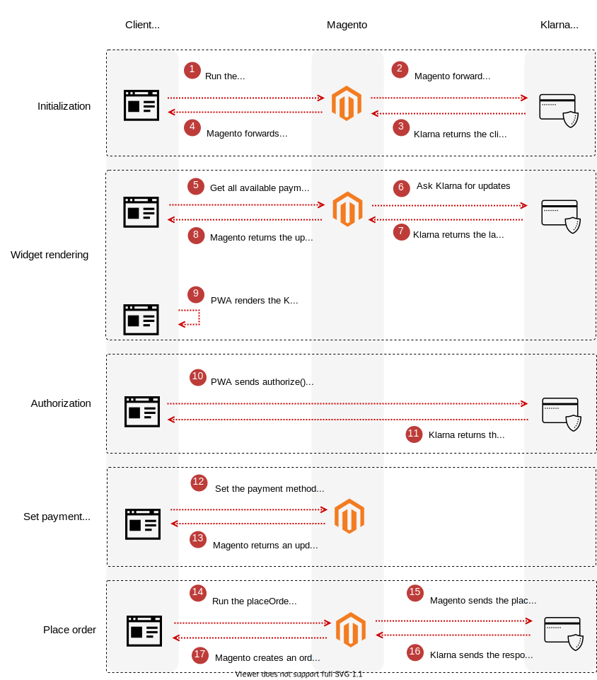
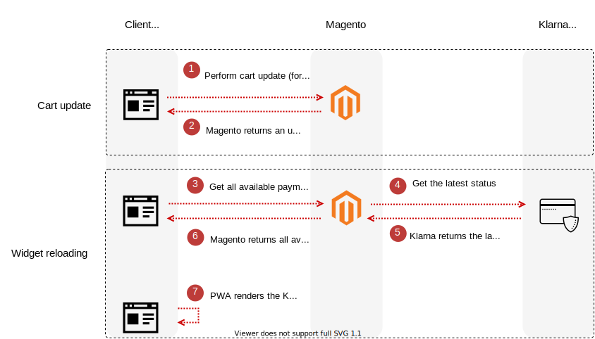

# Klarna payment method

Klarna Payments enables your consumers to try before they buy, finance purchases on your store with Klarna, or let them pay directly. Klarna offers these payment methods through a widget that you can add inline on your checkout page.

## Klarna payments workflow

The following diagram shows the workflow for placing an order when Klarna is the selected payment method.

Klarna payments require cart information to initiate the session. For this reason, the following steps can be executed only after a cart has been created.



1. The PWA client calls the [`createKlarnaPaymentsSession`](../schema/checkout/mutations/create-klarna-payments-session.md) mutation to generate the `client_token` and retrieve a list of `payment_categories`.

   This step can be executed at any time after the cart is created. However, we recommend that you add products to the cart and set the billing address, shipping address, and shipping method on the cart before you perform this step.

1. The application forwards the request to Klarna.

1. Klarna returns the `client_token` and the `payment_categories` available to the shopper.

1. The application forwards the token to the client.

1. The client sends the `cart` query to retrieve the available payment methods.

1. The application must always retrieve the latest status information from Klarna before returning the Klarna payments method as an option to the shopper. This is important to ensure that the shopper is always shown the latest available payment options.

1. Klarna returns an updated list of `payment_categories`.

1. The application returns all available payment methods, including Klarna payment methods.

1. The PWA client renders the Klarna payment widget.

   The PWA client uses the `client_token` and `payment_categories` to initialize the [Klarna Payments JS SDK](https://docs.klarna.com/klarna-payments/in-depth-knowledge/klarna-payments-sdk-reference/).

1. The PWA client sends the [authorization](https://docs.klarna.com/klarna-payments/integrate-with-klarna-payments/step-2-check-out/22-get-authorization/) directly to Klarna.

   On the checkout page, the shopper selects Klarna as the payment method and clicks **Place Order**. When this happens, the PWA client must send the `authorize()` call to Klarna. Then the shopper follows the authorization steps on the Klarna inline modal. During this phase, the communication between the PWA client and Klarna is handled directly by the Klarna Payments JS SDK.

1. Klarna returns the `authorization_token` in response to the authorize call.

1. Set the Payment Method providing the `authorization_token` as part of the `setPaymentMethodOnCart` mutation.

   The client uses the [`setPaymentMethodOnCart`](../schema/cart/mutations/set-payment-method.md) mutation to set the payment method to `klarna_<identifier-value>`. The `authorization_token` is passed in the `klarna` object.

1. The application returns an updated `cart` object.

1. The PWA client runs the `placeOrder` mutation.

1. The application sends the place order request to Klarna.

1. Klarna sends the response to Magento.

1. The application creates an order and sends an order ID in response to the `placeOrder` mutation.

## How to handle cart updates

During the purchase flow, the cart can be updated by adding additional products, applying coupons, and changing the billing or shipping address. All these events might cause a change in Klarna options for the specific shopper.

In order to always present shoppers with the latest available payment options provided by Klarna, the PWA client must:

1. Perform a cart update.

1. The application returns an updated `cart` object.

1. Send the `cart` query to retrieve the latest available payment methods.

1. The application sends another request to Klarna with the latest information available from the cart.

1. Klarna returns new list of payment methods. Note that the list might contain different options for the shopper.

1. The application returns an updated `cart` object.

1. [Reload the widget](https://docs.klarna.com/klarna-payments/integration-best-practices/purchase-experience/how-to-present-klarna-in-your-checkout/) on the client side.

The following diagram describes the workflow:



## setPaymentMethodOnCart mutation

When you set the payment method to Klarna in the [`setPaymentMethodOnCart`](../schema/cart/mutations/set-payment-method.md) mutation, the `payment_method` object must contain a `klarna` object.

### klarna object

The `klarna` object must contain the following attributes:

Attribute |  Data Type | Description
--- | --- | ---
`authorization_token` | String! | The one-time authorization token generated by the Klarna payment gateway based on shopper details collected during the purchase flow

## Example usage

The following example shows the  `setPaymentMethodOnCart` mutation constructed for the Klarna payment method.

**Request:**

```graphql
mutation {
  setPaymentMethodOnCart(input: {
    cart_id: "3WxC8gQn4Fbo55yqVLSiUFJ9fmEwnlxG"
    payment_method: {
      code: "klarna_pay_later"
      klarna: {
        authorization_token: "e9abc610-6748-256f-a506-355626551326"
      }
    }
  }) {
  cart {
    selected_payment_method {
      code
    }
  }
}
```

**Response:**

```json
{
  "data": {
    "setPaymentMethodOnCart": {
     "cart": {
       "selected_payment_method": {
         "code": "klarna_pay_later"
        }
      }
    }
  }
}
```
