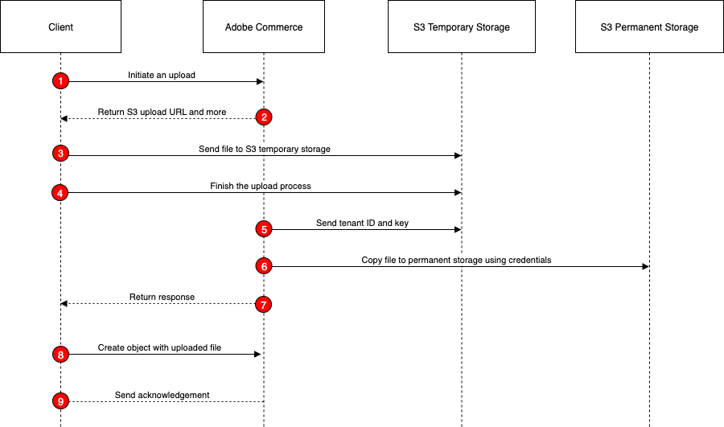

<Fragment src="../../../includes/saas-only.md"/>

# Upload files to Amazon S3

Adobe Commerce as a Cloud Service (SaaS) supports file uploads through GraphQL mutations. This feature allows you to upload files such as images, documents, and other media to the server. [Sharing objects with presigned URLs](https://docs.aws.amazon.com/AmazonS3/latest/userguide/ShareObjectPreSignedURL.html) describes how presigned URLs work.

Uploading files is a multi-step process, as shown in the following diagram:



1. **Initiate the upload**: The shopper clicks an **Upload File** button on the storefront. The Javascript code on the page uses the [`initiateUpload` mutation](mutations/initiate-upload.md) to start the upload process. The mutation specifies the file name provided by the shopper. Commerce uses the AWS SDK to generate the URL to which the file will be uploaded.

1. **Receive the response**: The response from the `initiateUpload` mutation includes a presigned URL, a unique key for the file, and an expiration time for the URL. The client code extracts these values from the response.

1. **Upload the file**: The client code uses the presigned URL to upload the file directly to a temporary location in the Amazon S3 bucket. This is done using a standard HTTP PUT request.

   The following curl command demonstrates how to upload a file using the presigned URL:

   ```bash
   curl --fail --show-error --silent -X PUT --data-binary @./cat.jpg 'https://<bucket>.s3.<region>.amazonaws.com/<path-to-temp-file>?X-Amz-Content-Sha256=UNSIGNED-PAYLOAD&X-Amz-Security-Token=<token>&X-Amz-Algorithm=AWS4-HMAC-SHA256&X-Amz-Credential=<value>&X-Amz-Date=<value>&X-Amz-SignedHeaders=host&X-Amz-Expires=<value>&X-Amz-Signature=<value>...'
   ```

1. **Finalize the upload**: After the file is successfully uploaded to S3, the client code calls the [`finishUpload` mutation](mutations/finish-upload.md) to complete the upload process. The mutation includes the unique key received from the `initiateUpload` response.

1. **Perform validation**: Commerce uses a HEAD request on S3 Temporary to validate the key and size.

1. **Move the file**: Commerce performs a `CopyObject` operation to move the file from the temporary location to a permanent location in the S3 bucket.

1. **Receive the final response**: The response from the `finishUpload` mutation includes the unique key for the uploaded file. The client code extracts this key from the response.

1. **Create or update the entity**: After `finishUpload` succeeds, the client creates or updates the entity (such as a customer) using the returned hashed key as the attribute value, not a URL or full S3 path.

1. **Receive the create/update response**: The response from the create or update mutation includes the details of the created or updated entity.

## Add the uploaded file to an entity

Your Adobe Commerce instance must define a custom attribute that has an input type of `file` or `image`. Presigned uploads are supported for the following entities, each managed under **Stores** > **Attributes** in the Admin:

* **Customer** and **Customer Address** attributes.
* **RMA (return) item** attributes (**Returns**).

Your custom attribute must have the following properties:

* **Attribute Code**: A unique identifier for the attribute, such as `profile_picture`.

* **Input Type**: Set to **File (attachment)** or **Image file**.

* **Maximum File Size**: The default file size limit on S3 is 16 MB (16777216 bytes).

Once the custom attribute is created, use the key returned by the `finishUpload` mutation as the attribute value when you create or update the entity. Set the value to the returned hashed key, not a URL or full S3 path.

### Add a file to a customer

If the customer custom attribute code is `profile_picture`, include it in the input of the `createCustomerV2` mutation:

```graphql
mutation {
  createCustomerV2(
    input: {
      email: "john.doe@example.com"
      firstname: "John"
      lastname: "Doe"
      password: "wzB43LF4svFd"
      custom_attributes: [
        {
          attribute_code: "profile_picture"
          value: "cat_106d42b2ee34de81db31d958.jpg"
        }
      ]
    }
  ) {
    customer {
      email
      firstname
      lastname
    }
  }
}
```

### Add a file to a customer address

Include the attribute in the `custom_attributesV2` input of the `createCustomerAddress` mutation. This mutation requires a customer token. The response returns the presigned GET `url` for the uploaded file.

```graphql
mutation {
  createCustomerAddress(
    input: {
      firstname: "John"
      lastname: "Doe"
      street: ["123 Main St"]
      city: "Montgomery"
      region: { region_id: 1 }
      postcode: "12345"
      country_code: US
      telephone: "1234567890"
      custom_attributesV2: [
        { attribute_code: "customer_address_image", value: "3_71e56be9494280b9d8b5d491.png" }
      ]
    }
  ) {
    id
    custom_attributesV2 {
      code
      ... on AttributeImage { value url }
      ... on AttributeFile { value url }
    }
  }
}
```

### Add a file to an RMA (return) item

Bind the uploaded key to a return item's file or image attribute through the `entered_custom_attributes` input of the `requestReturn` mutation. This mutation requires a customer token. The response returns the presigned GET `url` for the uploaded file.

```graphql
mutation {
  requestReturn(
    input: {
      order_uid: "<order-uid>"
      items: [
        {
          order_item_uid: "<order-item-uid>"
          quantity_to_return: 1
          entered_custom_attributes: [
            { attribute_code: "return_image", value: "damage_d4bb0cef2cac42c61b8d72f1.png" }
          ]
        }
      ]
    }
  ) {
    return {
      uid
      items {
        custom_attributesV2 {
          code
          ... on AttributeImage { value url }
          ... on AttributeFile { value url }
        }
      }
    }
  }
}
```

[Attribute interfaces and implementations](../attributes/interfaces/index.md) provides an example of how to retrieve a file uploaded to Amazon S3.
