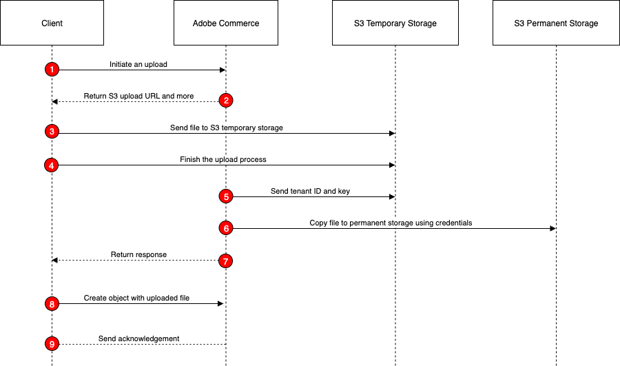

# Upload files to Amazon S3

Adobe Commerce as a Cloud Service (SaaS) supports file uploads through GraphQL mutations. This feature allows you to upload files such as images, documents, and other media to the server. Uploading files is a multi-step process, as shown in the following diagram:



1. **Inititiate the upload**: The shopper clicks an **Upload File** button on the storefront. The Javascript code on the page uses the `POST V1/media/initiate-upload` endpoint to start the uploard process. The call specifies the file name provided by the shopper. Commerce uses the AWS SDK to generate the URL to which the file will be uploaded.

1. **Receive the response**: The response from the `initiate-upload` call includes a presigned URL, a unique key for the file, and an expiration time for the URL. The client code extracts these values from the response.

1. **Upload the file**: The client code uses the presigned URL to upload the file directly to an Amazon S3 bucket. This is done using a standard HTTP PUT request. The file is uploaded to a temporary location in the S3 bucket.

1. **Finalize the upload**: After the file is successfully uploaded to S3, the client code calls the `POST V1/media/finish-upload` endpoint to complete the upload process. The mutation includes the unique key received from the `initiate-upload` response.

1. **Perform validation**: Commerce validates key and size (HEAD on S3 Temporary).

1. **Move the file**: Commerce performs a `CopyObject` operation to move the file from the temporary location to a permanent location in the S3 bucket.

1. **Receive the final response**: The response from the `POST V1/media/finish-upload` endpoint includes the unique key for the uploaded file. The client code extracts this key from the response.

1. **Create or update the entity**: After `POST V1/media/finish-upload` endpoint succeeds, the client creates or updates the entity (such as a customer) using the returned hashed key as the attribute value, not a URL or full S3 path.

1. **Receive the create/update response**: The response from the create or update call includes the details of the created or updated entity.

## Initiate the upload

Use the `POST V1/media/initiate-upload` endpoint to start the file upload process by generating a presigned URL for uploading a file to an Amazon S3 bucket. This endpoint requires the file name (`key`) and media resource type (`media_resource_type`) as input parameters. The `key` value cannot contain slashes. Currently, the only supported media resource type is `CATEGORY_IMAGE`.

When you call this endpoint, Commerce uses the AWS SDK to create a presigned URL that allows the client to upload the file directly to a temporary location in the S3 bucket. The presigned URL is valid for a limited time, specified by the `expires_at` field in the response.

The call requires an IMS access token.

```bash
curl --request POST \
  --url https://<server>.commerce.adobe.com/<tenant-id>/V1/media/initiate-upload \
  --header 'Authorization: Bearer <ACCESS_TOKEN>' \
  --header 'Content-Type: application/json' \
  --data '{
    "key": "1.png",
    "media_resource_type": "CATEGORY_IMAGE"
}'
```

## Upload the file to S3

The following curl command demonstrates how to upload a file using the presigned URL returned by the `POST V1/media/initiate-upload` call:

```bash
curl --fail --show-error --silent -X PUT --data-binary @./cat.jpg 'https://s3.amazonaws.com/na1-qa-ccsaas-instance-presigned/<tenant>/cat_106d42b2ee34de81db31d958.jpg?X-Amz-Content-Sha256=UNSIGNED-PAYLOAD&X-Amz-Security-Token=...&X-Amz-Algorithm=AWS4-HMAC-SHA256&X-Amz-Credential=...&X-Amz-Date=...&X-Amz-SignedHeaders=host&X-Amz-Expires=...&X-Amz-Signature=...'
```

## Finish the upload

Use the `POST V1/media/finish-upload` endpoint to complete the upload process after the file is successfully uploaded to S3. This endpoint includes the unique key received from the `initiate-upload` response.

When you call this endpoint, Commerce verifies that the file associated with the provided key has been successfully uploaded to the S3 bucket. If the upload is confirmed, Commerce finalizes the upload process and makes the file available for use within the system. The response from the `finish-upload` endpoint includes the unique key for the uploaded file. This key can be used to reference the file in subsequent operations, such as associating it with a customer file.

```bash
curl --request POST \
  --url https://server.commerce.adobe.com/<tenant-id>/V1/media/finish-upload \
  --header 'Authorization: Bearer <ACCESS_TOKEN>' \
  --header 'Content-Type: application/json' \
  --data '{
    "key": "<KEY_FROM_INITIATION>",
    "media_resource_type": "CATEGORY_IMAGE"
  }
```

## Add the uploaded file to an entity

Your Adobe Commerce instance must define a customer custom attribute that has an input type of `file` or `image`. Navigate to **Stores** > **Attributes** > **Customer** in the Admin and click **Add Attribute**. Your custom attribute must have the following properties:

* **Attribute Code**: A unique identifier for the attribute, such as `image`.

* **Input Type**: Set to **File (attachment)** or **Image file**.

* **Maximum File Size**: The default file size limit on S3 is 16 MB (16777216 bytes).

Once the custom attribute is created, you can use the key returned by the `finishUpload` mutation to set the value of the attribute when creating or updating a customer. For example, if the custom attribute code is `custom_image`, you would include it in the payload of the `/V1/categories` call as follows:

```json
{
    "category": {
        "parent_id": "2",
    "name": "One",
    "is_active": true,
    "include_in_menu": true,
        "custom_attributes": [
            {
                "attribute_code": "custom_image",
                "value": "1_7aa0b2d63f6d3dbf0290bb31.png"
            },
            {
                "attribute_code": "description",
                "value": "<p>test description one<\/p>"
            }
        ]
    }
}
```
