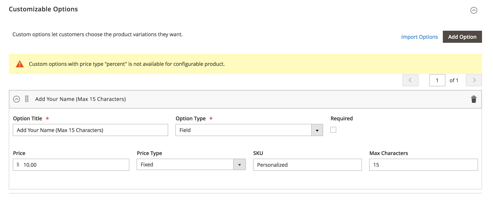
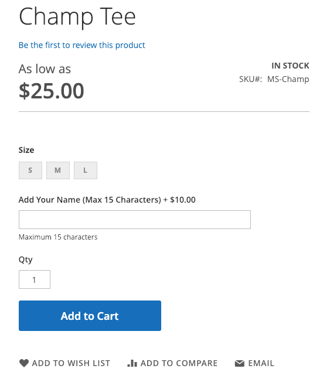

---
title: Step 5. Create the personalization option
description: In this step of the tutorial you will create the personalization options
--- 
 
# Step 5. Create the personalization option

Let's add a text box to the product page that allows the customer to add his name (up to 15 characters) to the back of shirt.

The `product_sku` is the `sku` of the configurable product. The `sku` specified in the payload is a string that is appended to the `product_sku` when a customer decides to purchase this option. Likewise, the `price` supplied in the payload is added to the configurable product price.

**Endpoint:**

`POST <host>/rest/default/V1/products/options`

**Payload:**

```json
{
  "option": {
    "product_sku": "MS-Champ",
    "title": "Add Your Name (Max 15 Characters)",
    "type": "field",
    "sort_order": 1,
    "is_require": false,
    "price": 10,
    "price_type": "fixed",
    "sku": "Personalized",
    "max_characters": 15
  }
}
```

**Response:**

```json
{
    "product_sku": "MS-Champ",
    "option_id": 7,
    "title": "Add Your Name (Max 15 Characters)",
    "type": "field",
    "sort_order": 1,
    "is_require": false,
    "price": 10,
    "price_type": "fixed",
    "sku": "Personalized",
    "max_characters": 15
}
```

## Verify this step

*  Log in to the Luma website and select **Catalog > Products**. Click on the **Champ Tee** configurable product and expand the **Customizable Options** section.

  

*  On the Luma storefront page, search for `Champ`. Then click on the Champ Tee product.

  

<InlineAlert variant="info" slots="text"/>

If the personalization option is not displayed, go to the **Champ Tee** configuration product page in Admin and set  **Stock Status** to **In Stock**.

## Congratulations! You've finished.

### Related topics

[Order Processing with REST APIs Tutorial](/rest/tutorials/orders/)
