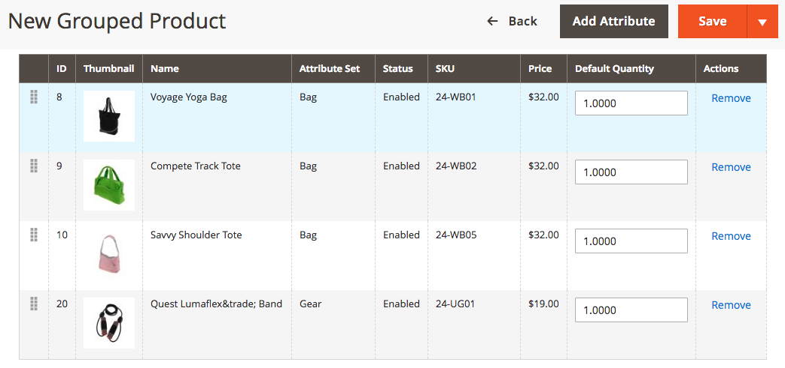

---
title: Create and manage grouped products tutorial
description: In this tutorial you will create and manage grouped products
--- 
 
# Create and manage grouped products tutorial

A grouped product consists of simple standalone products that are presented as a group. A group can contain variations of a single product or a collection of products that are to be sold together.

This tutorial describes how you can use the Magento REST API to create and manage grouped products.

### Before you begin

*  Install a Magento 2.2 (or later) instance with sample data. The sample data defines a functional store, called Luma, that sells fitness clothing and accessories.

*  Install a REST client. You can use any REST client to send calls to Magento. [Postman](https://www.getpostman.com/) is recommended.

*  Obtain an admin authorization token. All calls in this tutorial require administrator privileges. See [Generate the admin token](/rest/tutorials/prerequisite-tasks/) for more information.

### Other resources

*  [REST Tutorials](/rest/tutorials/index/) provides additional information about completing any Magento REST tutorial.

## 1. Create an empty grouped product

The first step is to create the grouped product container. In the next step, we'll add individual products to the grouped product.

### Endpoint

`POST V1/products`

### Payload

The `attribute_set_id: 11` line corresponds to gear. The value of `4` for the `visibility` attribute indicates the product will be displayed on the storefront and can be searched.

```json
    {
       "product":{
          "sku":"new-grouped",
          "name":"New Grouped Product",
          "attribute_set_id":11,
          "type_id":"grouped",
          "visibility":4
       }
    }
```

### Response

```json
{
    "id": 2053,
    "sku": "new-grouped",
    "name": "New Grouped Product",
    "attribute_set_id": 11,
    "status": 1,
    "visibility": 4,
    "type_id": "grouped",
    "created_at": "2019-08-15 17:51:13",
    "updated_at": "2019-08-15 17:51:13",
    "extension_attributes": {
        "website_ids": [
            1
        ],
        "stock_item": {
            "item_id": 2053,
            "product_id": 2053,
            "stock_id": 1,
            "qty": 0,
            "is_in_stock": false,
            "is_qty_decimal": false,
            "show_default_notification_message": false,
            "use_config_min_qty": true,
            "min_qty": 0,
            "use_config_min_sale_qty": 1,
            "min_sale_qty": 1,
            "use_config_max_sale_qty": true,
            "max_sale_qty": 10000,
            "use_config_backorders": true,
            "backorders": 0,
            "use_config_notify_stock_qty": true,
            "notify_stock_qty": 1,
            "use_config_qty_increments": true,
            "qty_increments": 0,
            "use_config_enable_qty_inc": true,
            "enable_qty_increments": false,
            "use_config_manage_stock": true,
            "manage_stock": true,
            "low_stock_date": null,
            "is_decimal_divided": false,
            "stock_status_changed_auto": 0
        }
    },
    "product_links": [],
    "options": [],
    "media_gallery_entries": [],
    "tier_prices": [],
    "custom_attributes": [
        {
            "attribute_code": "options_container",
            "value": "container2"
        },
        {
            "attribute_code": "url_key",
            "value": "new-grouped-product"
        },
        {
            "attribute_code": "required_options",
            "value": "0"
        },
        {
            "attribute_code": "has_options",
            "value": "0"
        },
        {
            "attribute_code": "category_ids",
            "value": []
        }
    ]
}
```

## 2. Populate the grouped product with simple products

Now that we have created a grouped product, we need to add simple items to it. In this example, we add three types of backpacks.

### Endpoint

`POST V1/products/new-grouped/links`

### Payload

```json
    {
       "items":[
          {
             "sku":"new-grouped",
             "link_type":"associated",
             "linked_product_sku":"24-WB01",
             "linked_product_type":"simple",
             "position":1,
             "extension_attributes":{
                "qty":1
             }
          },
          {
             "sku":"new-grouped",
             "link_type":"associated",
             "linked_product_sku":"24-WB02",
             "linked_product_type":"simple",
             "position":2,
             "extension_attributes":{
                "qty":1
             }
          },
          {
             "sku":"new-grouped",
             "link_type":"associated",
             "linked_product_sku":"24-WB05",
             "linked_product_type":"simple",
             "position":3,
             "extension_attributes":{
                "qty":1
             }
          }
       ]
    }
```

### Response

`true`

## 3. Add another simple product to the grouped product

This step uses the `PUT /V1/products/new-grouped/links` endpoint to add an item to the grouped product.

### Endpoint

`PUT /V1/products/new-grouped/links`

### Payload

```json
    {
       "entity":{
          "sku":"new-grouped",
          "link_type":"associated",
          "linked_product_sku":"24-UG01",
          "linked_product_type":"simple",
          "position":4,
          "extension_attributes":{
             "qty":1
          }
       }
    }
```

### Response

`true`

<InlineAlert variant="success" slots="text"/>

You also can use the `DELETE` endpoint to delete a simple product from the group product:
`DELETE /V1/products/{sku}/links/{type}/{linkedProductSku}`

## Verify the steps

1. Log into the Admin.
1. Select **Catalog > Products**.
1. Click on the **New Grouped Product** grouped product and expand the **Grouped Products** section.

  

## Add a grouped product to a cart

Customers can now add this grouped products to their carts, as shown below.

Refer to the [Order processing tutorial](/rest/tutorials/orders/) for more information about how to add items to a cart with REST.

### Endpoint

`POST /V1/carts/mine/items`

### Payload

```json
{
 "cartItem": {
   "sku": "new-grouped",
   "qty": 1,
   "quote_id": "3"
   }
}
```

### Response

```json
{
   "item_id": 5,
   "sku": "24-WB01",
   "qty": 1,
   "name": "Voyage Yoga Bag",
   "price": 32,
   "product_type": "grouped",
   "quote_id": "3"
}
```
