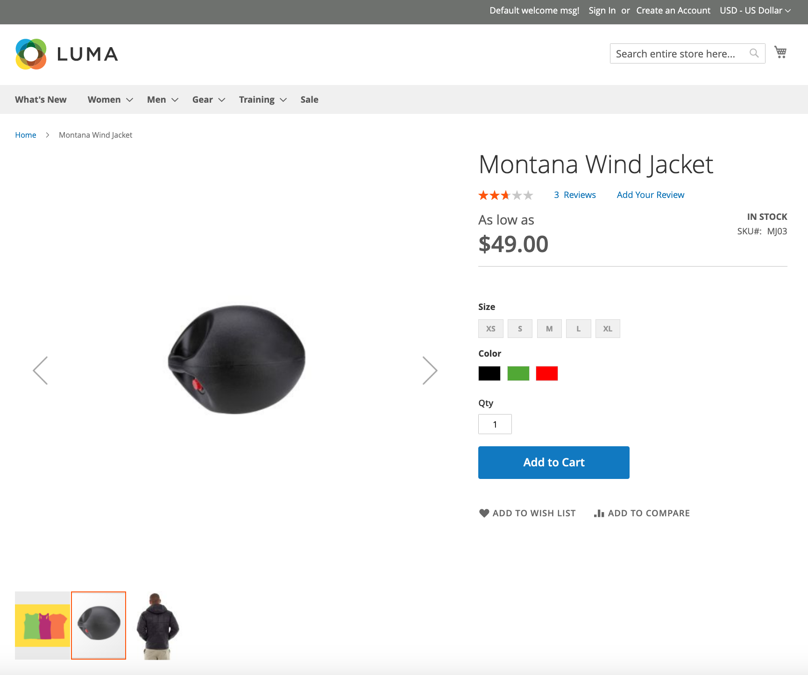

---
title: Delete an image 
contributor_name: Goivvy LLC
contributor_link: https://www.goivvy.com/
description: We will learn how to delete an existing image 
--- 

# Delete an image

In this step, we will delete an image from a SKU. In this example, we'll use the image `id` of `695`. Use the [list API call](https://developer.adobe.com/commerce/webapi/rest/tutorials/image/list/) to see image IDs for your SKU.

Run the following command to delete an image from the specified SKU:

**Endpoint:**

```html
DELETE http://domain.com/rest/default/V1/products/MJ03/media/695
```

The payload must be empty.

**Response:**

```json
true
```

## Verify this step

Refresh the `MJ03` product page and see if your the image was deleted.

.
