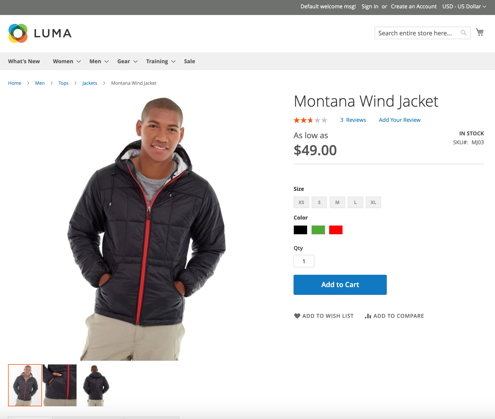

---
title: Step 1. Getting a list of product images 
contributor_name: Goivvy LLC
contributor_link: https://www.goivvy.com/
description: We will learn how to get a list of all product images.
--- 

# Step 1. Getting a list of product images

In this step, we will get all image information for the product with SKU `MJ03`.

Run the following command to list all images for the specified SKU:

**Endpoint:**

`GET http://domain.com/rest/default/V1/products/MJ03/media`

**Response:**

```json
[
    {
        "id": 694,
        "media_type": "image",
        "label": "",
        "position": 1,
        "disabled": false,
        "types": [
            "image",
            "small_image",
            "thumbnail"
        ],
        "file": "/m/j/mj03-black_main_1.jpg"
    },
    {
        "id": 695,
        "media_type": "image",
        "label": "",
        "position": 2,
        "disabled": false,
        "types": [],
        "file": "/m/j/mj03-black_alt1_1.jpg"
    },
    {
        "id": 696,
        "media_type": "image",
        "label": "",
        "position": 3,
        "disabled": false,
        "types": [],
        "file": "/m/j/mj03-black_back_1.jpg"
    }
]
```

We will use the image **id** for later steps in this tutorial.

## Verify this step

1. On the storefront page, search for `MJ03`.

1. Select the product in the search results.
    

1. There should be three images.

