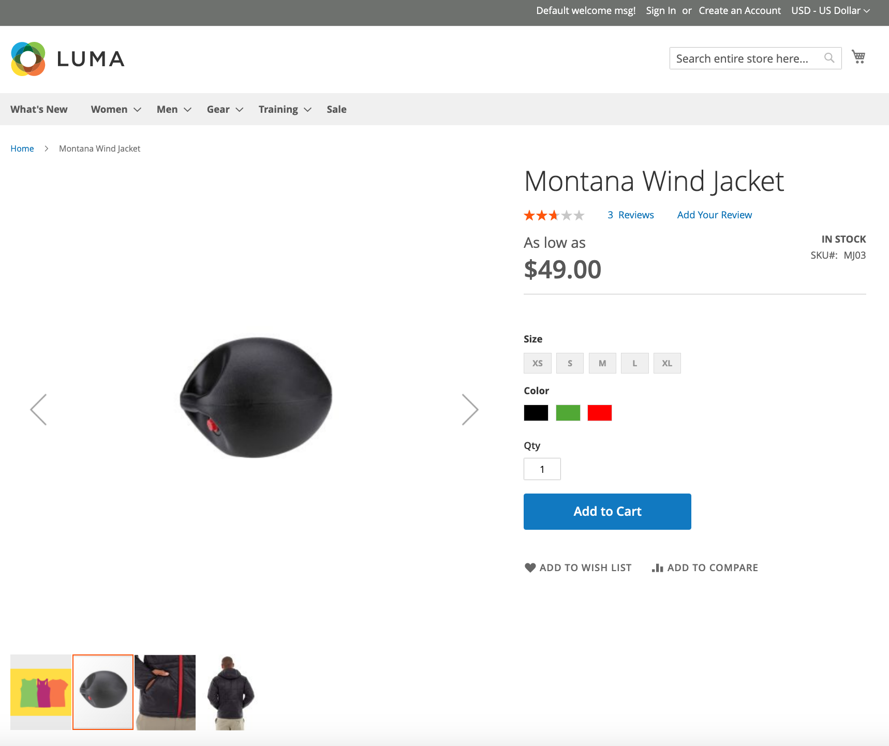

---
title: Update an image 
contributor_name: Goivvy LLC
contributor_link: https://www.goivvy.com/
description: We will learn how to update an existing image 
--- 

# Update an image

In this step we will update an existing image with the `id` of `694`. We previously retrieved this `id` number in [Step 1. Getting a list of product images](https://developer.adobe.com/commerce/webapi/rest/tutorials/image/list/).

1. Using the following image, open a bash terminal and convert the image into `base64`:


```bash
base64 -i ~/update-new-image.png
iVBORw0KGgoAAAANSUhEUgAAARwAAAFICAYAAACC60EBAAAKrGlDQ1BJQ0MgUHJvZmlsZQAASImVlwdUU8kax+fem16AkBABKaE3QToBpITQQpcONkISIJQQA0HFriwu4FpQEcGKLooouBZA1oootkWxANYNsqgo62LBhsq7wCG4+85777zvnDnzu//7zTffzJm557sAUNX4UmkmrAZAliRXFhngw4pPSGThnwIyIAIacAYIX5Aj5UREhADUJvq/2/tOAI32t61HY/37+/9qNKEoRwAAFIFysjBHkIXycbS9EEhluQAgu1HdaEGudJRbUWbI0ARR7h7l1HEeGOXkMcaAMZ/oSC7KDAAIFD5flgoAhYXqrDxBKhqH4o2yrUQolqAsRdkzKytbiPIRlM1RH1SjjMZnJ38XJ/VvMZOVMfn8VCWPr2XMCL7iHGkmf9H/uR3/27Iy5RNzmKKNkiYLjER7dXTPujOyg5UsSQ4Ln2CxcMx/jNPkgTETLMjhJk6wkO8brBybGRYywSlif54yTi4veoJFOX5REyzLjlTOlSLjciaYL5ucV54Ro9TTRDxl/Py06LgJzhPHhk1wTkZU8KQPV6nL5JHK/EWSAJ/Jef2Va8/K+W69Yp5ybG5adKBy7fzJ/EUSzmTMnHhlbkKRr9+kT4zSX5rro5xLmhmh9BdlBij1nLwo5dhc9EBOjo1Q7mE6PyhiggEXZINMtMkAC4SgT74A5IoW5o4uhJstXSQTp6blsjjoDROxeBKBzTSWva29PQCj93X8OLxljt1DiHl1UstqQo8xgt6RokkteRAAVAa01knN1BoA1a8AnFYI5LK8cW3sLmEBCagCBtACesAImANrYI9....[more characters]
```

An API call:

**Endpoint:**

```html
PUT http://domain.com/rest/default/V1/products/MJ03/media
```

<CodeBlock slots="heading, code" repeat="2" languages="JSON, JSON" />

#### Payload

```json
{
    "entry": {
        "id": 694,
        "media_type": "image",
        "label": "Custom Image Number 2",
        "position": 1,
        "disabled": false,
        "types": [
            "image",
            "small_image",
            "thumbnail"
        ],
        "content": {
            "base64_encoded_data": "iVBORw0KGgoAAAANSUhEUgAAARwAAAFICAYAAACC60EBAAAKrGlDQ1BJQ0MgUHJvZmlsZQAASImVlwdUU8kax+fem16AkBABKaE3QToBpITQQpcONkISIJQQA0HFriwu4FpQEcGKLooouBZA1oootkWxANYNsqgo62LBhsq7wCG4+85777zvnDnzu//7zTffzJm557sAUNX4UmkmrAZAliRXFhngw4pPSGThnwIyIAIacAYIX5Aj5UREhADUJvq/2/tOAI32t61HY/37+/9qNKEoRwAAFIFysjBHkIXycbS9EEhluQAgu1HdaEGudJRbUWbI0ARR7h7l1HEeGOXkMcaAMZ/oSC7KDAAIFD5flgoAhYXqrDxBKhqH4o2yrUQolqAsRdkzKytbiPIRlM1RH1SjjMZnJ38XJ/VvMZOVMfn8VCWPr2XMCL7iHGkmf9H/uR3/27Iy5RNzmKKNkiYLjER7dXTPujOyg5UsSQ4Ln2CxcMx/jNPkgTETLMjhJk6wkO8brBybGRYywSlif54yTi4veoJFOX5REyzLjlTOlSLjciaYL5ucV54Ro9TTRDxl/Py06LgJzhPHhk1wTkZU8KQPV6nL5JHK/EWSAJ/Jef2Va8/K+W69Yp5ybG5adKBy7fzJ/EUSzmTMnHhlbkKRr9+kT4zSX5rro5xLmhmh9BdlBij1nLwo5dhc9EBOjo1Q7mE6PyhiggEXZINMtMkAC4SgT74A5IoW5o4uhJstXSQTp6blsjjoDROxeBKBzTSWva29PQCj93X8OLxljt1DiHl1UstqQo8xgt6RokkteRAAVAa01knN1BoA1a8AnFYI5LK8cW3sLmEBCagCBtACesAImANrYI9....[more characters]",
            "type": "image/png",
            "name": "custom_image_2.png"
        }
    }
}
```

#### Response

```json
true
```

## Verify this step

Open `MJ03` product and notice an update image.



